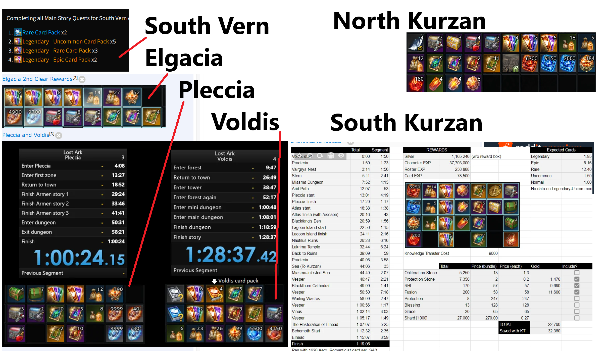

# Daily

## Wandering merchants

Notable cards:
Laitir (Yorn) sells Balthorr Card
Aricer (Rohendel) sells Azena and Inanna Card
Mac (Anikka) sells Wei Card

But there are also other cards you may want
Make sure to check your map and what each merchant is currently selling every day, or twice a day (merchants stay for 5h30 then rotate)

## Una Task

3x per character (can repeat same task on alt but won't receive rep again)

Prioritise reputation that reward masterpieces
Prioritise reputation that reward card packs
Prioritise tasks that reward honing materials

## Chaos Dungeon 

2x per character

Do highest possible

## Guardian Raid

1x per character

Do highest possible

Solo if your ilvl is low and you don't find a group through matching and you have the time

## Mokoko Playground

Rewards: Event shop currency

Every hour

Mokoko Paradise (Use ocean liner from any region to get to it quickly)

Don't start the run at the front, wait behind everyone and pass the players at the first turn when everyone gets knocked down or out
At the end, pick a quadrant with the least player and just spam headbutt. Don't go fighting the big duck, just spam headbutt on ducks

## Blooming Mokoko 

Rewards: Silver and Gold (chance of up to 200k gold)

Every even hour (12, 2, 4, etc)

Must be at the center at the start to participate

Look at minimap and go towards where people aren't going/are

Usually pick a zone in the port and just run around in circles there unless too many people come there too

Use high mobility class and park the character there (I use aeromancer personally)

## Chaos Gate

Rewards:
Honing Materials
Cards
Engravings
Gems
Gold

Every hour

1x per roster 

You can find a gate in most regions. Just show up, join, kill the boss and collect rewards. Very easy and straightforward

## Stronghold

Make sure to research and send ships daily

Make sure to check the merchant inventory for card packs and card xp too

# Weekly

## Una Weekly Task

3x per character

There are several tasks with the same objectives but different rewards.

Do whichever reward the most of what you currently need

## Gold content

You can earn gold from three separate instance of end game content. You must tick the box "Collect gold rewards" when entering the content to get the gold reward (usually already checked, so careful when joining low level content to not waste a gold collection)

End-game content is either legion raids, epic raids (behemoth), abyss dungeons

Do three of the highest level possible every week on each character (if they have access to content that give enough gold to justify spending that time doing it, up to you)

e.g. I am ilvl 1540, I would do and collect gold for Brelshaza, Kayangel, and Kaku-Saydon

## Raids and dungeons

Do all possible raids and dungeons in solo mode. This is to get xp and a chance at cards.

Make sure to not collect gold rewards for lower ilvl content, you usally are locked out of gold rewards for low level content but double check.

## Cards

Buy card packs from merchant in Peyto (14k pirate coins for 7)

Buy card packs from merchant in Fermata (14k pirate coins for 7)

# Rest

## Cards

At leat once, complete all towers (4 total). You can select Level 50 of the new tower to complete all directly.
This will also reward you lots of materials and silver

Do main story quests on your alts. I personally use Knowledge Transfer (in your stronghold) to get them to lvl 50 and ilvl500, hone and knowledge transfer until South Vern, then I do all the main story quests from there until Kurzan (included) for card packs. This takes A LOT of time, but guaranteed way to get card packs.

Work on collecting masterpieces for guaranteed 1x Wei card and 1x Legendary card pack

## Skill Points

Collect all potions: https://maxroll.gg/lost-ark/resources/lost-ark-skill-point-guide#skill-points-sources-header

Level up to 60 through quests/raid/dungeons

_[Main Menu](../readme.md)_

## Horizontal Progression

Make sure to do the Arkesia Tour (icon left of your minimap) - it will speed you through a lot of collection for each map (almost 80% for most)
