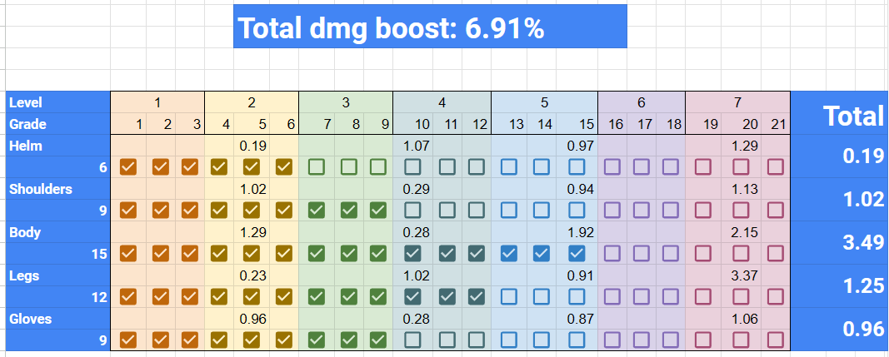

# Transcendence Priority Calculator

[Maxxroll Transcendence Guide](https://maxroll.gg/lost-ark/resources/transcendence-system-guide)

This only supports armor for now

Values taken from [Bracelet & Elixir Calculator](https://docs.google.com/spreadsheets/d/1AAwVLWSqYcRguTL4Dhw6i76MT9LSLDynlWPiPT7UyZ4/edit?usp=sharing)

Simply tick what levels you've already achieved, and tick what you could potentially achieve based on dark fire available (and trans level you can unlock) to see what is the max dmg boost you can get this week, until you get more dark fire.

# [Link to the calculator](https://docs.google.com/spreadsheets/d/1yk3Ep51F6aJeopMDbUudzgBahAABAE76LbogjbRo_zM/edit?usp=sharing)

`File > Make a Copy` so you can start editing the copy and playing with the calc

_[Main Menu](../)_
